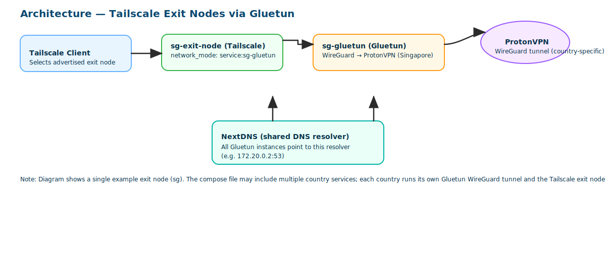

# Tailscale VPN Exit Nodes via Gluetun

Run multiple country-based Tailscale exit nodes, each tunneled through a VPN provider via Gluetun. The example uses ProtonVPN, but you can replace it with any provider supported by Gluetun.

## How this works



Each country gets its own Gluetun instance with a dedicated WireGuard configuration. The Tailscale exit node container shares Gluetun's network namespace, so all its traffic goes through the VPN tunnel. All Gluetun instances are attached to a shared `vpnlink` network with static IPs — this helps Tailscale establish direct connections.

## Why this works

Gluetun and Tailscale share the same Docker network namespace.

Tailscale exposes its internal DNS resolver at `100.100.100.100`
inside that shared namespace.

Gluetun forwards DNS queries directly to that resolver:

```yaml
DNS_ADDRESS=100.100.100.100
```

## Prerequisites

- Docker + Docker Compose
- [Tailscale](https://tailscale.com) account
- A VPN provider supported by [Gluetun](https://github.com/qdm12/gluetun-wiki/tree/main/setup/providers) (example uses ProtonVPN with WireGuard)

## Setup

### 1. Create the external network

```bash
docker network create --subnet=172.20.0.0/16 vpnlink
```

### 2. Create external volumes

```bash
docker volume create sg-exit-node-data
docker volume create ca-exit-node-data
```

### 3. Fill in the placeholders

| Placeholder | Description |
|---|---|
| `<wireguard_private_key>` | WireGuard private key from your VPN provider (for ProtonVPN, find it under Downloads → WireGuard configuration) |
| `<wireguard_addresses>` | WireGuard IP assigned by your VPN provider (for ProtonVPN, e.g. `10.2.0.2/32`) |
| `<tailscale_auth_key>` | Tailscale auth key |
| `<timezone>` | Your timezone (e.g. `America/New_York`) |

### 4. Approve exit nodes

After bringing the stack up, approve each exit node in the [Tailscale admin panel](https://login.tailscale.com/admin/machines) under the machine's settings.

### 5. Bring it up

Start all nodes:

```bash
docker compose up -d
```

Or start specific nodes only:

```bash
docker compose up -d sg-gluetun sg-exit-node
```

## Adding more countries

Copy any `*-gluetun` + `*-exit-node` service block, update the country name, assign a new static IP in the `vpnlink` subnet, create a volume for it, and fill in the placeholders.

## Notes

- Each Gluetun instance uses a separate WireGuard tunnel, so they are fully isolated from each other
- Gluetun uses `100.100.100.100` (Tailscale MagicDNS) as the DNS resolver
- Tailscale containers do not need `NET_ADMIN` capability since they inherit the network namespace from Gluetun
